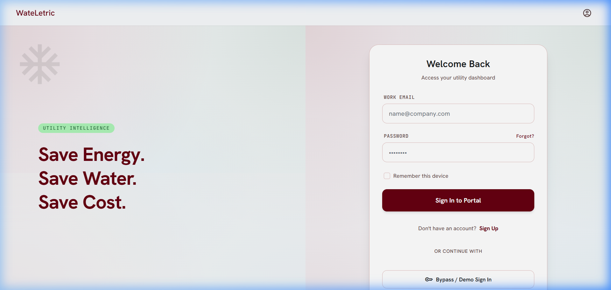
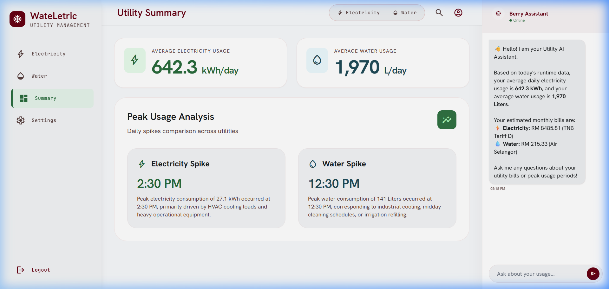
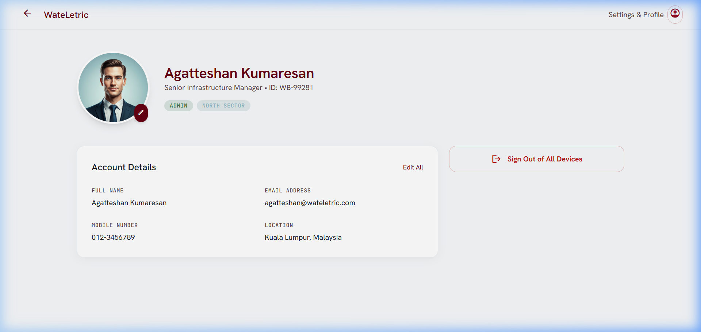

# WateLetric - Smart Utility Management Platform

WateLetric is an AI-powered smart utility management and monitoring platform designed for non-domestic and industrial facilities. It dynamically monitors energy and water usage, forecasts future loads using local Machine Learning models (XGBoost), flags anomalies, and integrates with Google Gemini for context-aware explanations and optimizations.

---

## 👥 Team Information

*   **Team Name:**Dim Sum**
*   **Team Members:**
    *   **Agatteshan Kumaresan**
    *   **Aliff Aiman Abdul Halim**
    *   **Imran Yusri**

---

## 🛠️ Technologies Used

WateLetric integrates a robust set of tools across frontend, backend, analytical, and cloud layers:

*   **Backend Server:** Python 3 (using standard `http.server.ThreadingHTTPServer`), `sqlite3` relational database, `urllib` for API requests.
*   **Frontend UI:** HTML5, CSS3, Tailwind CSS, Google Hanken Grotesk & JetBrains Mono Fonts, Material Symbols, and dynamic SVG/Chart.js rendering.
*   **Machine Learning Pipeline:** XGBoost Regressor (`xgboost`), `pandas` for data manipulation, `numpy` for scientific calculations, and `scikit-learn` for evaluation metrics.
*   **Cloud Integrations:**
    *   **Google Gemini API:** `gemini-2.5-flash` model for context-aware AI assistant responses.
    *   **Firebase Authentication:** Firebase client SDKs v10 for login and session state routing.
    *   **Telegram Bot API:** HTTP webhooks for real-time Markdown alert notification dispatching.

---

## 💡 Challenge and Approach

### The Challenge
Non-domestic and industrial facilities experience high utility cost volatility. Inefficient equipment use, unmonitored baseline leaks, and irregular occupancy variations make utility cost control extremely difficult. Standard monitoring tools are static, lagging, and fail to provide facility managers with the real-time context needed to make immediate adjustments.

### The Approach
WateLetric solves this by combining local machine learning forecasting with a real-time event-driven UI and generative AI:
1.  **Baseline Modeling:** We train an **XGBoost Regressor** on clean historical utility data (excluding anomalies) to establish a clean consumption baseline mapped to occupancy and time.
2.  **Dynamic Anomaly Detection:** Real-time sensor readings are streamed, and the system dynamically computes the deviation from predicted baselines. If the actual reading exceeds thresholds (e.g. deviation > 5.0 kWh for electricity, or > 10.0 Liters/hr for water under zero occupancy), a critical anomaly is flagged.
3.  **Actionable Generative AI:** Upon anomaly detection, the UI updates its state and packages the exact consumption parameters into a system prompt. The **Google Gemini API** consumes this context to output natural, clear, and actionable setpoint optimization proposals.
4.  **Instant Notifications:** The server compiles anomaly details into Markdown alerts and pushes them immediately to a **Telegram Bot** channel to notify facility operators.

---

## 📂 Project Structure

```text
├── .env                              # API keys, Telegram Bot Tokens, & Firebase settings
├── db_init.py                        # Database setup & initial static data seeding script
├── run_agent.py                      # ML training, forecasting computation, & data synchronization
├── server.py                         # HTTP file server, Gemini chat proxy, & alert endpoint
├── utility_data.db                   # Local SQLite3 database storing metrics & daily summaries
├── system_design.md                  # Comprehensive architectural blueprint & system flows
├── data/                             # JSON datasets and active simulation streams
│   ├── mock_dataset_electricity_30days.json
│   ├── mock_dataset_water_30days.json
│   ├── runtime_data_electric.json
│   └── runtime_data_water.json
├── models/                           # Validation/training scripts for model baselines
│   ├── model_electricity.py
│   └── model_water.py
└── public/                           # Frontend assets and web server directory root
    ├── index.html                    # Authentication Portal / Landing page
    ├── summary.html                  # Unified dual-utility analytics dashboard
    ├── electricity.html              # Electricity consumption & forecast dashboard
    ├── water.html                    # Water leakage, usage, & pumping metrics dashboard
    ├── profile.html                  # User account details settings panel
    ├── design.html                   # HTML layout design mockup
    ├── billing_data.js               # Static JS cache containing compiled forecast data
    ├── firebase-mock.js              # Local mock wrapper fallback for offline development
    └── screenshots/                  # Verification screen captures for README rendering
        ├── login_page.png
        ├── summary_page.png
        └── profile_page.png
```

---

## ⚙️ Configuration & Secrets

Configure local API keys and bot webhooks by creating/editing the `.env` file in the root directory:

```env
GEMINI_API_KEY=your_google_gemini_api_key_here
TELEGRAM_BOT_TOKEN=your_telegram_bot_token_here
TELEGRAM_CHAT_ID=your_telegram_chat_id_here
FIREBASE_API_KEY=your_firebase_api_key_here
PROJECT_ID=your_firebase_project_id_here
PROJECT_NUMBER=your_firebase_project_number_here
```

*Note: If `TELEGRAM_BOT_TOKEN` or `TELEGRAM_CHAT_ID` are left unconfigured, the system automatically redirects alert payloads to safe, local standard output logging (Simulation Mode).*

---

## 🚀 Quick Start Guide

Follow these steps to install dependencies, train the forecasting models, initialize records, and host the web dashboard locally.

### 1. Prerequisite Installations
Ensure you have Python 3 installed. Install the necessary packages:
```bash
pip install pandas numpy xgboost python-dotenv
```

### 2. Initialize the SQLite Database
Create the database tables and populate them with the initial static dashboard records:
```bash
python db_init.py
```

### 3. Run the Predictive Forecasting Pipeline
Train the XGBoost baseline forecasting models and compute projected billing costs, monthly aggregates, and anomalies:
```bash
python run_agent.py
```
*Note: This script generates updated configurations and overrides `billing_data.js` and `utility_data.db`.*

### 4. Deploy the Local Web Server
Start the multi-threaded backend server with unbuffered logging outputs (`-u`):
```bash
python -u server.py
```

### 5. Access the Platform
Open your browser and navigate to `http://localhost:8000/index.html`. Use the **"Bypass / Demo Sign In"** button to log in instantly using cached details, or use **Firebase Auth** for registration.

---

## 📸 User Interface Screenshots

### Login & Authentication Portal


### Unified Dual-Utility Summary Dashboard


### Cleaned Settings/User Profile Page

