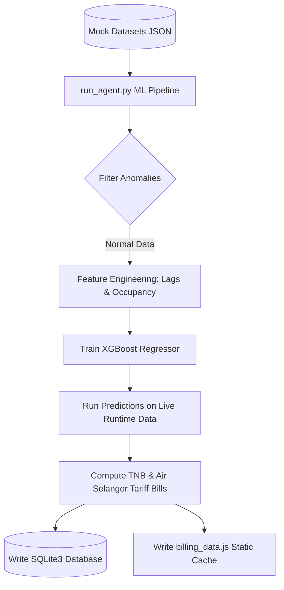
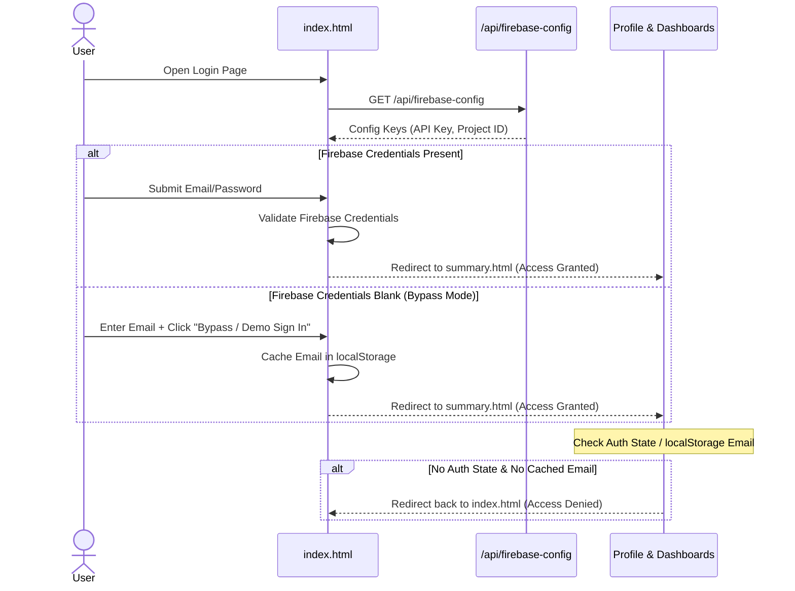
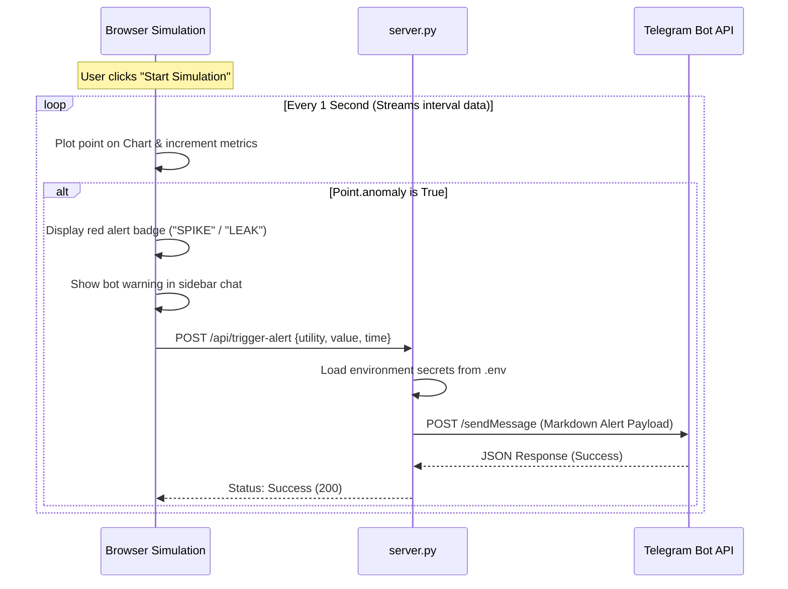
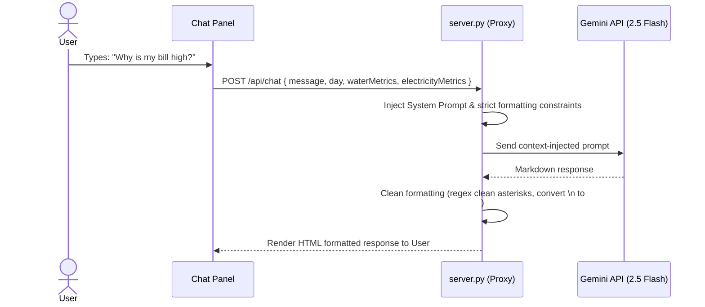

# WateLetric - System Design & Flow Document

This document provides a comprehensive blueprint of the **WateLetric** Smart Utility Management platform. It details the technology stack, the architectural flows of data and user interactions, and the operational flow of developer tools/scripts.

---

## 1. Complete Technology Stack

WateLetric utilizes a hybrid architecture combining local predictive machine learning (XGBoost) with cloud-based generative AI (Google Gemini) and cloud-based authentication (Firebase).

```
+--------------------------------------------------------------------------+
|                            FRONTEND (UI/UX)                              |
|   HTML5  •  Vanilla JS  •  Tailwind CSS (CDN)  •  Material Symbols       |
+--------------------------------------------------------------------------+
                                     |
                                     v
+--------------------------------------------------------------------------+
|                       LIGHTWEIGHT PYTHON SERVER                          |
|         ThreadingHTTPServer  •  urllib  •  dotenv  •  sqlite3            |
+--------------------------------------------------------------------------+
          /                          |                           \
         v                           v                            v
+-------------------+      +-------------------+      +--------------------+
|  LOCAL DATABASES  |      |   MACHINE LEARNING|      |   EXTERNAL CLOUD   |
|   SQLite3 (.db)   |      |  XGBoost Regressor|      |  Google Gemini API |
|   billing_data.js |      |   Pandas & NumPy  |      | Firebase Auth SDK  |
|                   |      |                   |      | Telegram Bot API   |
+-------------------+      +-------------------+      +--------------------+
```

### A. Frontend Layer
*   **Structure & Logic:** HTML5 and Vanilla Javascript (ES6+).
*   **Styling & Icons:** CSS3, Tailwind CSS (fetched via CDN), Google Fonts (*Hanken Grotesk*, *JetBrains Mono*), and Google Material Symbols Outlined.
*   **Rendering Libraries:** Dynamic Chart.js/SVG graph visualization.

### B. Backend Web Server Layer
*   **Language & Core:** Python 3.
*   **HTTP Server:** Multi-threaded `ThreadingHTTPServer` (derived from standard library `http.server.SimpleHTTPRequestHandler`) acting as both a static file server and an API proxy.
*   **Environment Configuration:** `python-dotenv` for loading secrets from `.env`.

### C. Database & Data Storage Layer
*   **SQLite3 (`utility_data.db`):** Relational database storing parsed daily summaries, 30-minute interval metrics, and computed peak records.
*   **Static JS Cache (`billing_data.js`):** A pre-compiled JavaScript data bundle containing structured utility data loaded by the frontend on startup.

### D. Machine Learning & Analytics Layer
*   **Algorithms:** XGBoost Regressor (`xgboost` library) for training electricity and water baseline usage models.
*   **Data Science Tools:** `pandas` and `numpy` for data cleaning, lag feature engineering, anomaly filtering, and tariff calculations.

### E. Integrations & External APIs
*   **Large Language Model:** Google Gemini API (`gemini-2.5-flash`) for the context-injected conversational utility assistant ("Berry Assistant").
*   **Identity & Session Security:** Firebase Authentication Client SDK v10 (email/password registry, dynamic login credentials, dynamic session state routing, and `localStorage` demo bypass caching).
*   **Alert Webhook:** Telegram Bot API for real-time facility anomaly notifications using Markdown formatting.

---

## 2. Flow of the System

This section details how data, user requests, and background endpoints flow through the WateLetric ecosystem.

### A. Offline Data Preparation & Model Training Flow
Before the server runs, models must be trained and baseline projections computed:



1.  **Load Datasets:** `run_agent.py` imports 30 days of historical interval data.
2.  **Establish Clean Baseline:** Anomaly records (sensor spikes/leaks) are filtered out so the model learns normal facility behaviors.
3.  **Feature Engineering:** Features like time-of-day, day-of-week, occupancy, and historical lag attributes are computed.
4.  **XGBoost Training:** Models for electricity (kWh) and water (Liters) are trained.
5.  **Predict & Calculate:** The model predicts baseline usage for runtime data, projects monthly totals, and calculates estimated tariffs.
6.  **Export:** Projections are saved in the SQLite database and exported into the static JavaScript variable file `billing_data.js`.

---

### B. User Authentication & Authorization Flow
Controls how users access the dashboards:



---

### C. Live Simulation & Real-Time Anomaly Alerting Flow
Visualizes dynamic sensor feeds and handles notifications when anomalies are reached:



---

### D. Context-Aware AI Chatbot (Berry Assistant) Flow
Allows users to ask natural language questions about dashboard details:



---

## 3. Flow of the Tools Used

This section illustrates the sequence in which operational tools, CLI utilities, and background processes are run to deploy and verify the application.

```
[Tool 1: db_init.py]
  └── Setup Database Tables (daily_summaries, intervals)
  └── Parse initial billing_data.js and sync to utility_data.db
       │
       v
[Tool 2: run_agent.py]
  └── Train XGBoost models
  └── Run predictive forecasting on runtime datasets
  └── Overwrite static billing_data.js cache
  └── Overwrite utility_data.db SQLite records
  └── Trigger background Telegram Alerts test
       │
       v
[Tool 3: server.py]
  └── Load environment configurations (.env)
  └── Host local HTTP Server on http://localhost:8000/
  └── Run unbuffered logs output (-u)
  └── Handle live POST routes (/api/chat, /api/trigger-alert)
       │
       v
[Tool 4: Client Web Browser]
  └── Render index.html login/bypass views
  └── Handle session states and local settings details
  └── Feed live simulation charts
```

### 1. Database Setup (`db_init.py`)
*   **Role:** Initializes SQLite structures.
*   **Command:** `.venv\Scripts\python.exe db_init.py`
*   **Execution Flow:**
    *   Checks if `utility_data.db` exists (creates tables `daily_summaries` and `intervals` if missing).
    *   Reads and parses `billing_data.js` via regex to extract JSON objects.
    *   Synchronizes and seeds the database with the day's interval metrics and daily summaries.

### 2. Analytical Pipeline (`run_agent.py`)
*   **Role:** Regenerates models and syncs forecast variables.
*   **Command:** `.venv\Scripts\python.exe run_agent.py`
*   **Execution Flow:**
    *   Fits regression models and writes predictions back to the database.
    *   Dumps fresh JSON configurations to `billing_data.js` so client dashboards update.
    *   Runs the `process_utility_alerts` method to verify Telegram notification configurations.

### 3. Application Server Hosting (`server.py`)
*   **Role:** Serves files and acts as API routing gateway.
*   **Command:** `.venv\Scripts\python.exe -u server.py`
*   **Execution Flow:**
    *   Runs with unbuffered output (`-u`) to write HTTP request transactions and alert printing directly to background logs.
    *   Loads local environmental tokens (such as `GEMINI_API_KEY`, `TELEGRAM_BOT_TOKEN`) into memory.
    *   Listens on `http://localhost:8000/` to server HTML layouts, script controllers, and SQLite proxy endpoints.

### 4. Client Dashboard Interface (Web Browser)
*   **Role:** Visualizes dashboard dashboards and drives the simulation loop.
*   **Execution Flow:**
    *   Bypasses the client-side disk caches when testing files (using unique URL query parameters like `?nocache=1`).
    *   Caches session email profiles inside `localStorage` for dynamic profile views.
    *   Triggers the background server `/api/trigger-alert` whenever chart data playback encounters an anomaly.
