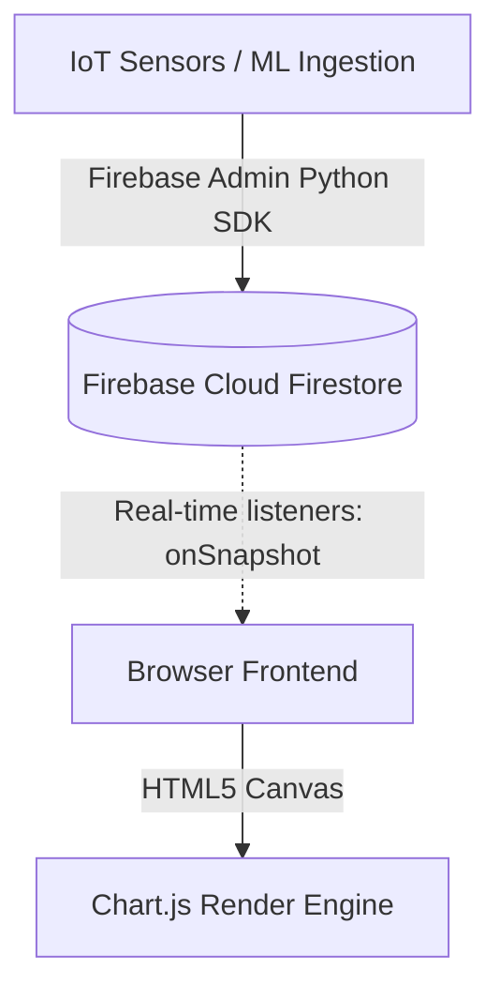

# WateLetric - Web Optimization & Production Scalability Plan (Firebase Integration)

This document outlines the architectural changes required to transition the WateLetric web application from a static, file-based simulation to a scalable, database-driven dashboard. These upgrades leverage **Firebase** for cloud data storage and real-time syncing, and **Chart.js** for high-performance frontend graphing.

---

## 1. Core Architectural Pillars



### A. Database Storage (Firebase Firestore)
Transition from static JSON arrays (`mock_dataset_*.json`, `billing_data.js`) to Firebase collections:
* **`daily_summaries` Collection**: Stores day-level aggregate KPIs (Projected bills, averages, surge percentages, peak hours).
* **`intervals` Collection**: Stores high-resolution 30-minute sensor consumption values, XGBoost predictions, and anomaly triggers as sub-collections or time-series documents.
* **Benefits**: No manual database maintenance, built-in horizontal scaling, and automatic indexing.

### B. Real-Time Synchronization (Firebase Web SDK)
Instead of building custom python REST API endpoints and polling them:
* The frontend uses the **Firebase JS SDK** to connect directly to the database.
* Uses `onSnapshot()` to listen for real-time document updates. As new sensor values are pushed from the IoT network to Firestore, the frontend updates automatically.

### C. Canvas-Based UI Graphing (Chart.js)
Eliminate high-overhead HTML flexbox elements (which trigger expensive layout repaints when updated) in favor of canvas rendering:
* Render thousands of points in milliseconds.
* Built-in responsiveness, animations, legends, and hover tooltips.

---

## 2. Proposed Implementation Steps

### Step 1: Initialize Firebase & Ingestion Pipeline (`db_init.py`)
A python script using the `firebase-admin` SDK to configure the Firestore collections and upload historical metrics:
```python
import firebase_admin
from firebase_admin import credentials, firestore
import json

def init_firebase():
    # Initialize using service account key
    cred = credentials.Certificate("firebase-credentials.json")
    firebase_admin.initialize_app(cred)
    db = firestore.client()
    
    # Example seeding function for Day 1 Electricity intervals
    with open("runtime_data_electric.json") as f:
        data = json.load(f)
        
    for index, record in enumerate(data):
        doc_ref = db.collection("intervals").document(f"day1_electricity_{index}")
        doc_ref.set({
            "day": 1,
            "utility_type": "electricity",
            "time": record["time"],
            "value": record["electricity_kwh"],
            "anomaly": record.get("anomaly", False)
        })
    print("Database seeding completed.")
```

### Step 2: Update Machine Learning Script (`run_agent.py`)
Modify `run_agent.py` to upload predictions directly to Firestore collections:
```python
# Instead of writing to billing_data.js:
# db.collection("daily_summaries").document("day1_electricity").set({
#     "actual_so_far": actuals_elec,
#     "projected_total": projected_elec_kwh,
#     "estimated_bill": estimated_elec_bill,
#     "daily_avg": elec_daily_avg
# })
```

### Step 3: Integrate Firebase Web SDK in Dashboards
Include Firebase SDK libraries via CDN in `electricity.html` and `water.html`:
```html
<!-- Firebase App and Firestore SDKs -->
<script src="https://www.gstatic.com/firebasejs/10.8.0/firebase-app-compat.js"></script>
<script src="https://www.gstatic.com/firebasejs/10.8.0/firebase-firestore-compat.js"></script>

<script>
  // Firebase configuration
  const firebaseConfig = {
    apiKey: "YOUR_API_KEY",
    authDomain: "YOUR_PROJECT_ID.firebaseapp.com",
    projectId: "YOUR_PROJECT_ID",
    storageBucket: "YOUR_PROJECT_ID.appspot.com",
    messagingSenderId: "YOUR_MESSAGING_SENDER_ID",
    appId: "YOUR_APP_ID"
  };
  
  firebase.initializeApp(firebaseConfig);
  const db = firebase.firestore();
</script>
```

### Step 4: Upgrade Frontend Charts to Chart.js & Real-Time Sync
Replace Flexbox chart markup with canvas and setup real-time data binding:
```html
<!-- NEW CANVAS GRAPH -->
<div class="h-64 w-full relative">
    <canvas id="consumption-chart"></canvas>
</div>

<script src="https://cdn.jsdelivr.net/npm/chart.js"></script>
<script>
    // Initialize Chart.js Bar Chart
    const ctx = document.getElementById('consumption-chart').getContext('2d');
    const chart = new Chart(ctx, {
        type: 'bar',
        data: { labels: [], datasets: [{ label: 'kWh', data: [] }] },
        options: { responsive: true, maintainAspectRatio: false }
    });

    // Setup Firestore listener for real-time streaming
    db.collection("intervals")
      .where("day", "==", 1)
      .where("utility_type", "==", "electricity")
      .orderBy("time")
      .onSnapshot((snapshot) => {
          const times = [];
          const values = [];
          snapshot.forEach((doc) => {
              const data = doc.data();
              times.push(data.time_str || data.time);
              values.push(data.value);
          });
          
          chart.data.labels = times;
          chart.data.datasets[0].data = values;
          chart.update();
      });
</script>
```

---

## 3. Key Benefits
1. **Serverless Scale**: Firebase handles automatic load balancing and data replication in the cloud.
2. **True Real-Time Updates**: Frontend updates immediately as soon as a background model inserts anomaly points, without any API pooling delay.
3. **Reduced Server Logic**: Simplifies `server.py` to strictly serve files and act as a GenAI Gemini proxy, offloading all data-traffic logic directly to Firebase.
